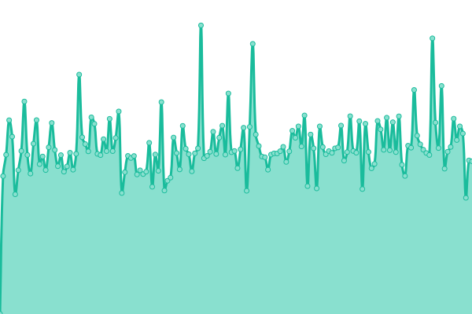
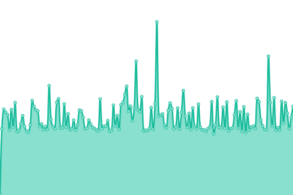
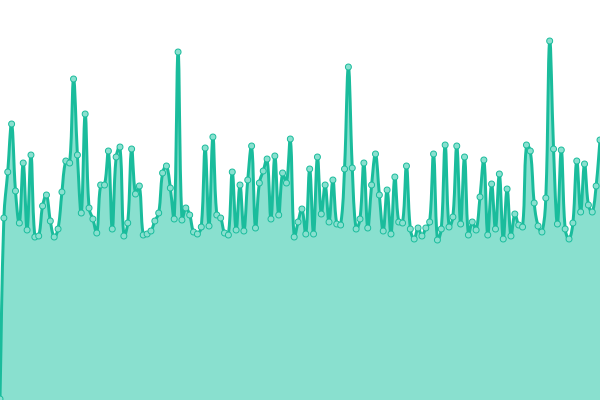

# [📈 Live Status](https://status.wickepedia.org): <!--live status--> **🟥 Complete outage**

This repository contains the open-source uptime monitor and status page for [wickepedia](https://wickepedia.org), powered by [Upptime](https://github.com/upptime/upptime).

With [Upptime](https://upptime.js.org), you can get your own unlimited and free uptime monitor and status page, powered entirely by a GitHub repository. We use [Issues](https://github.com/wickepedia/upptime/issues) as incident reports, [Actions](https://github.com/wickepedia/upptime/actions) as uptime monitors, and [Pages](https://status.wickepedia.org) for the status page.

<!--start: status pages-->
<!-- This summary is generated by Upptime (https://github.com/upptime/upptime) -->
<!-- Do not edit this manually, your changes will be overwritten -->
<!-- prettier-ignore -->
| URL | Status | History | Response Time | Uptime |
| --- | ------ | ------- | ------------- | ------ |
|  [Wiki DE](https://de.wickepedia.org) | 🟥 Down | [wiki-de.yml](https://github.com/wickepedia/status/commits/HEAD/history/wiki-de.yml) | 

 486ms
     
 | 

<a href="https://status.wickepedia.org/history/wiki-de">36.18%</a>
    

|  [Wiki EN](https://en.wickepedia.org) | 🟥 Down | [wiki-en.yml](https://github.com/wickepedia/status/commits/HEAD/history/wiki-en.yml) | 

 447ms
     
 | 

<a href="https://status.wickepedia.org/history/wiki-en">36.17%</a>
    

|  [Wiki Apex](https://wickepedia.org) | 🟥 Down | [wiki-apex.yml](https://github.com/wickepedia/status/commits/HEAD/history/wiki-apex.yml) | 

 429ms
     
 | 

<a href="https://status.wickepedia.org/history/wiki-apex">36.17%</a>
    

|  [Short URL](https://wickepedia.org/r/3) | 🟥 Down | [short-url.yml](https://github.com/wickepedia/status/commits/HEAD/history/short-url.yml) | 

 291ms
     
 | 

<a href="https://status.wickepedia.org/history/short-url">36.17%</a>
    

|  [REST API](https://de.wickepedia.org/rest.php/v1/page/Main_Page) | 🟥 Down | [rest-api.yml](https://github.com/wickepedia/status/commits/HEAD/history/rest-api.yml) | 

 80ms
     
 | 

<a href="https://status.wickepedia.org/history/rest-api">36.17%</a>
    

|  [Parsoid](https://de.wickepedia.org/api.php?action=visualeditor&format=json&paction=parse&page=Main_Page) | 🟥 Down | [parsoid.yml](https://github.com/wickepedia/status/commits/HEAD/history/parsoid.yml) | 

 124ms
     
 | 

<a href="https://status.wickepedia.org/history/parsoid">34.32%</a>
    

<!--end: status pages-->

[**Visit our status website →**](https://status.wickepedia.org)

## 📄 License

- Powered by: [Upptime](https://github.com/upptime/upptime)
- Code: [MIT](./LICENSE) © [wickepedia](https://wickepedia.org)
- Data in the `./history` directory: [Open Database License](https://opendatacommons.org/licenses/odbl/1-0/)
